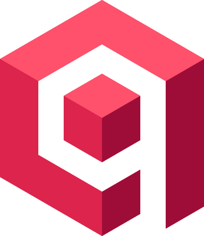

  
  
  

  

##  About Me

I recently graduated **_Summa Cum Laude_** from **UCLouvain (École Polytechnique de Louvain)** with an **MSc in Computer Science & Engineering**, specializing in **Artificial Intelligence**.

I'm looking to join a team as an **AI / ML Engineer**, building AI systems that actually ship to production.

I'm passionate about **Computer Vision**, **Natural Language Processing**, and **Generative AI** (LLMs, RAG & Agentic AI) — and I enjoy engineering the entire pipeline behind them, from large-scale training on HPC GPU clusters (SLURM) to Docker-containerized deployment on Azure and full-stack delivery.

I'm open to **AI / ML Engineer** roles in **Belgium** (on-site/hybrid) or **fully remote across the EU**.

Reach out via [LinkedIn](https://www.linkedin.com/in/mathis-delsart/) or at [mathis.delsart@gmail.com](mailto:mathis.delsart@gmail.com).

##  Tech Stack

<table>
<tr>
<td valign="top" width="25%">

**ML & DL**

</td>
<td valign="top" width="25%">

**Generative AI**

</td>
<td valign="top" width="25%">

**Web & Backend**

</td>
<td valign="top" width="25%">

**Databases**

 

</td>
</tr>
<tr>
<td valign="top" width="25%">

**DevOps & Cloud**

</td>
<td valign="top" width="25%">

**Systems & Embedded**

</td>
<td valign="top" width="25%">

**Dev Tools**

</td>
<td valign="top" width="25%">

**AI Tooling**

</td>
</tr>
</table>

##  Research — Master's Thesis

**Deep Reinforcement Learning for Competitive Agents in MicroRTS — Architecture, Training, and Tournament Evaluation**

*UCLouvain · Completed June 2026* &nbsp;·&nbsp; *Accepted at IEEE CoG 2026*

A DRL agent for real-time strategy games, fusing a **U-Net spatial encoder** with an **entity-level Transformer** (UECD) and trained end-to-end with a **modular PPO** pipeline on HPC GPU clusters (SLURM) — every design decision individually ablated.

- 🥇 **96.67%** pool win rate — tops a 19-agent tournament (1st on 4 of 5 metrics)
- ⚔️ Beats **RAISocketAI** (CoG competition winner) in **65.7%** of head-to-heads
- ⚡ Trained on just **9.47 GPU-days** — vs the 23.6 reported by RAISocketAI

 

<b>UECD-Best</b> (ours, top-left) vs RAISocketAI (bottom-right)

📂 *[**View the repository →**](https://github.com/mathisdelsart/microrts-drl-uecd)*

##  Featured Projects

<b>Deep Learning & Computer Vision</b>

 

| Project | Description | Stack |
|:--------|:------------|:------|
| [**Satellite-Image-Segmentation**](https://github.com/mathisdelsart/satellite-image-segmentation) | Satellite image segmentation with supervised & self-supervised learning |    |
| [**3D-Hand-Gesture-Classification**](https://github.com/mathisdelsart/3d-hand-gesture-classification) | Comparative study: KNN, LSTM, DenseNet, HMM for 3D gesture recognition |     |
| [**GANs-Diffusion-Kernels**](https://github.com/mathisdelsart/gans-diffusion-kernels) | Advanced generative models: GANs, diffusion models, kernel methods |      |
| [**Heart-Failure-Detection-Smurf**](https://github.com/mathisdelsart/heart-failure-detection-smurf) | Heart-failure risk prediction on a fictional *"Smurf Society"* dataset (synthetic, not real clinical data) |      |
| [**ML-Classification**](https://github.com/mathisdelsart/ml-classification) | Supervised learning models for medical & biological datasets |     |
| [**Celebrity-Dataset-Explorer**](https://github.com/mathisdelsart/celebrity-dataset-explorer) | Interactive face attribute analysis with clustering & dimensionality reduction |      |

<b>Natural Language Processing & LLMs</b>

 

| Project | Description | Stack |
|:--------|:------------|:------|
| [**Grounded-RAG**](https://github.com/mathisdelsart/grounded-rag) | Grounded RAG-LLM answering strictly from your own documents, with citations & a faithfulness guard |      |
| [**NLP-Models**](https://github.com/mathisdelsart/nlp-models) | Progressive NLP pipeline: Question Classification (Naive Bayes), Vector Semantics (TF-IDF/PPMI/Word2Vec), BERT-based QA (SQuAD) |      |
| [**Text-Prediction-TwitOZ**](https://github.com/mathisdelsart/text-prediction-TwitOZ) | Intelligent text prediction system using N-grams algorithm with real-time word suggestions |   |

<b>Game AI & Reinforcement Learning</b>

 

| Project | Description | Stack |
|:--------|:------------|:------|
| [**Snakes-Ladders-MDP**](https://github.com/mathisdelsart/snakes-ladders-mdp) | Optimal strategy via Markov Decision Processes & Q-Learning |    |
| [**AI-Odyssey**](https://github.com/mathisdelsart/ai-odyssey) | Search algorithms: uninformed to adversarial game-playing agents |     |
| [**AI-Connect4-Game**](https://github.com/mathisdelsart/ai-connect4-game) | Connect 4 with Minimax AI — Can you beat a machine that thinks 4 moves ahead? |    |

<b>Data Science & Analytics</b>

 

| Project | Description | Stack |
|:--------|:------------|:------|
| [**Data-Science-Portfolio**](https://github.com/mathisdelsart/data-science-portfolio) | Applied statistics & data science: energy analysis, star classification, species clustering |      |
| [**Pattern-Mining**](https://github.com/mathisdelsart/pattern-mining) | Pattern mining: frequent itemsets, sequential patterns, and Bayesian networks |     |
| [**Database-SQL**](https://github.com/mathisdelsart/database-sql) | SQL query optimization and Neo4j graph analysis with Cypher |     |

<b>Systems Programming & Compilers</b>

 

| Project | Description | Stack |
|:--------|:------------|:------|
| [**Custom-Compiler**](https://github.com/mathisdelsart/custom-compiler) | Full compiler: custom language → JVM bytecode |     |
| [**Prolog-Python-Analyzer**](https://github.com/mathisdelsart/prolog-python-analyzer) | Prolog-powered static analyzer for Python code detecting 13+ code smells through declarative pattern matching on ASTs |    |
| [**Scheme-OOP**](https://github.com/mathisdelsart/scheme-oop) | Building OOP from scratch in pure Scheme: classes, inheritance, and polymorphism from closures and message passing |    |
| [**Java-COP**](https://github.com/mathisdelsart/java-cop) | Context-Oriented Programming in Java using reflection, dynamic proxies, and bytecode instrumentation with custom profiler agent |    |

<b>Low-Level Systems & Embedded</b>

 

| Project | Description | Stack |
|:--------|:------------|:------|
| [**CORDIC-FPGA-Accelerator**](https://github.com/mathisdelsart/cordic-fpga-accelerator) | High-performance FPGA accelerator integrated with ARM processor |     |
| [**High-Performance-Server**](https://github.com/mathisdelsart/high-performance-server) | High-performance HTTP matrix multiplication server on NGINX with progressive optimizations: cache-aware algorithms, SIMD (AVX-512), and CUDA GPU acceleration |     |
| [**Multithreaded-Bellman-Ford**](https://github.com/mathisdelsart/multithreaded-bellman-ford) | Parallel single-source shortest-path (Bellman-Ford) in C, parallelized with a POSIX-thread pool — ~6× faster on large graphs |    |
| [**Dynamic-Memory-Allocator**](https://github.com/mathisdelsart/dynamic-memory-allocator) | Custom heap allocator with next-fit & coalescing |   |
| [**Concurrent-Bench-Sync-Primitives**](https://github.com/mathisdelsart/concurrent-bench-sync-primitives) | Performance benchmarking framework for custom synchronization primitives (TS, TTS, BTTS) vs POSIX on Reader-Writer, Dining Philosophers, Producer-Consumer |     |
| [**Tar-Archive-Parser**](https://github.com/mathisdelsart/tar-archive-parser) | Lightweight TAR archive parser in C — validation, file operations, symlink resolution |    |

<b>Numerical Computing & Optimization</b>

 

| Project | Description | Stack |
|:--------|:------------|:------|
| [**FEM-Bridge-Simulator**](https://github.com/mathisdelsart/fem-bridge-simulator) | Finite element simulator for bridge structures under static loads, featuring 2D elasticity modeling and animations |      |
| [**Optimization-Algorithm**](https://github.com/mathisdelsart/optimization-algorithm) | Solving NP-hard problems: exact methods, relaxations, heuristics |    |
| [**Algorithm-and-Data-Structures**](https://github.com/mathisdelsart/algorithm-and-data-structures) | Clean and well-tested core data structures and algorithms with performance focus |    |

<b>Web & Mobile Development</b>

 

| Project | Description | Stack |
|:--------|:------------|:------|
| [**Shopping-Cart-Application**](https://github.com/mathisdelsart/shopping-cart-application) | Scalable microservices e-commerce platform with custom recommendations, smart ranking, and dynamic shopping |       |
| [**Private-Tutoring**](https://github.com/mathisdelsart/private-tutoring) | Bilingual, responsive tutoring website, statically deployed to GitHub Pages |     |
| [**Energy-Tracker-MeterBuddy**](https://github.com/mathisdelsart/energy-tracker-MeterBuddy) | Android energy-consumption tracker with charts, Room storage, and Firebase sync |      |

<b>Games</b>

 

| Project | Description | Stack |
|:--------|:------------|:------|
| [**Chess-Game**](https://github.com/mathisdelsart/chess-game) | Full chess rules, multiple themes, and a clean Pygame interface |   |
| [**Flappy-Bird-Game**](https://github.com/mathisdelsart/flappy-bird-game) | Classic Flappy Bird recreation with physics and animations |   |
| [**Modern-Snake-Game**](https://github.com/mathisdelsart/modern-snake-game) | Modern, polished Snake game with gradients and animations |   |

<b>Coursework & Foundations</b>

 

| Project | Description | Stack |
|:--------|:------------|:------|
| [**EPL-Chronicles**](https://github.com/mathisdelsart/epl-chronicles) | Aggregated UCLouvain coursework: systems, ML, data science & programming paradigms |      |

##  GitHub Stats

  

  

