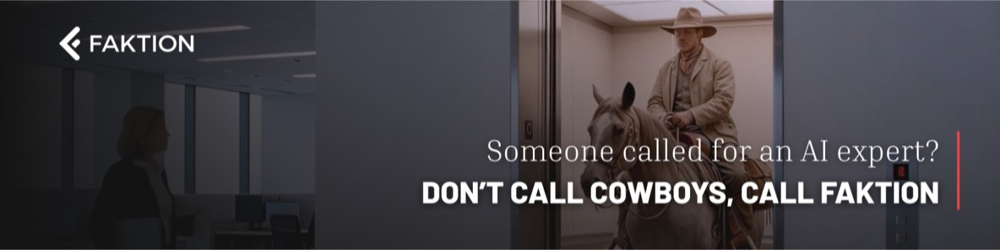
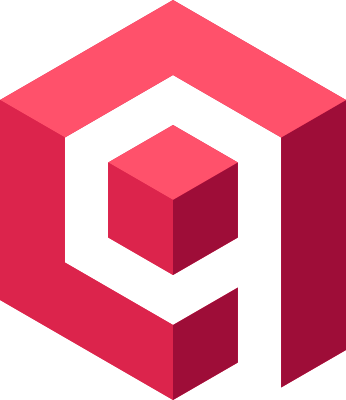

<p align="center">
  <a href="https://www.linkedin.com/in/mathis-delsart/">
    
  </a>
  <a href="mailto:mathis.delsart@gmail.com">
    
  </a>
  <a href="https://orcid.org/0009-0005-1136-9203">
    
  </a>
</p>

<p align="center">
  
</p>

##  About Me

I'm an **AI Engineer** at **[Faktion](https://www.faktion.com)** (Antwerp), building LLM-based and agentic AI solutions for enterprise clients, from prototype to production on **Azure**.

I graduated **_Summa Cum Laude_** from **UCLouvain (École Polytechnique de Louvain)** with an **M.Sc. in Computer Science & Engineering**, specializing in **Artificial Intelligence**. My master's thesis on deep reinforcement learning was presented at **IEEE CoG 2026** and won **2nd place** at the **IEEE/ICTEAM Best Master Thesis Award 2026**.

I'm passionate about **Generative AI**, **Agentic AI**, **Machine Learning** and **Computer Science** as a whole. What I enjoy most is building the entire pipeline end to end, from the agentic core to full-stack delivery, and seeing the result come to life in production.

Happy to connect about applied AI, agents in production and AI research: [LinkedIn](https://www.linkedin.com/in/mathis-delsart/) or [mathis.delsart@gmail.com](mailto:mathis.delsart@gmail.com).


##  Tech Stack

<table>
<tr>
<td valign="top" width="25%">

**ML & DL**

<p align="left">


</p>

</td>
<td valign="top" width="25%">

**Generative AI**

<p align="left">


</p>

</td>
<td valign="top" width="25%">

**Web & Backend**

<p align="left">


</p>

</td>
<td valign="top" width="25%">

**Databases**

<p align="left">
<br>


</p>

</td>
</tr>
<tr>
<td valign="top" width="25%">

**DevOps & Cloud**

<p align="left">


</p>

</td>
<td valign="top" width="25%">

**Systems & Embedded**

<p align="left">


</p>

</td>
<td valign="top" width="25%">

**Dev Tools**

<p align="left">

</p>

</td>
<td valign="top" width="25%">

**LLM Platforms**

<p align="left">


</p>

</td>
</tr>
</table>


##  Research: Master's Thesis

**Deep Reinforcement Learning for Competitive Agents in MicroRTS: Architecture, Training, and Tournament Evaluation**

*UCLouvain · June 2026* &nbsp;·&nbsp; *Presented at IEEE CoG 2026 (Madrid)* &nbsp;·&nbsp; 🥈 *2nd place, IEEE/ICTEAM Best Master Thesis Award 2026*

A DRL agent for real-time strategy games, fusing a **U-Net spatial encoder** with an **entity-level Transformer** (UECD) and trained end-to-end with a **modular PPO** pipeline on HPC GPU clusters (SLURM), with every design decision individually ablated.

- 🥇 **96.67%** pool win rate, topping a 19-agent tournament (1st on 4 of 5 metrics)
- ⚔️ **9-1** head-to-head record against **RAISocketAI** (prior MicroRTS competition winner)
- ⚡ Trained on just **9.4 GPU-days**, roughly **7× less compute**

[](https://mathisdelsart.github.io/microrts-drl-uecd-website/)
[](https://github.com/mathisdelsart/microrts-drl-uecd/blob/main/cog-2026-paper/cog_paper.pdf)
[](https://github.com/mathisdelsart/microrts-drl-uecd/blob/main/dissertation/dissertation.pdf)


<br>


<sub><b>UECD-Best</b> (ours, top-left) vs RAISocketAI (bottom-right)</sub>

📂 *[**View the repository →**](https://github.com/mathisdelsart/microrts-drl-uecd)*


##  Publications

**Combining Spatial and Entity-Based Reasoning for Competitive MicroRTS via U-Net and Transformers**
<br>*Mathis Delsart, Achille Morenville, Éric Piette* &nbsp;·&nbsp; IEEE Conference on Games (CoG) 2026, Madrid

[](https://github.com/mathisdelsart/microrts-drl-uecd/blob/main/cog-2026-paper/cog_paper.pdf)

<details>
<summary>BibTeX</summary>

```bibtex
@inproceedings{delsart2026uecd,
  title     = {Combining Spatial and Entity-Based Reasoning for Competitive MicroRTS via U-Net and Transformers},
  author    = {Delsart, Mathis and Morenville, Achille and Piette, {\'E}ric},
  booktitle = {Proceedings of the IEEE Conference on Games (CoG)},
  year      = {2026},
  address   = {Madrid, Spain}
}
```

</details>


##  Featured Projects

<details open>
<summary><b>Generative AI & LLMs</b></summary>
<br>

| Project | Repo | Description | Stack |
|:--------|:----:|:------------|:------|
| ***Sourcio***: RAG Study Assistant | [](https://github.com/mathisdelsart/sourcio) | Deployed RAG tutor answering **only** from your own courses, with citation-by-construction (the model never sees a page number) + a three-layer refusal guard. [**Live app**](https://sourcio-tutor.vercel.app): **100%** citations, **96%** refusal accuracy |       |
| ***NLP-Models*** | [](https://github.com/mathisdelsart/nlp-models) | Progressive NLP pipeline: Question Classification (Naive Bayes), Vector Semantics (TF-IDF/PPMI/Word2Vec), BERT-based QA (SQuAD) |      |
| ***Text-Prediction-TwitOZ*** | [](https://github.com/mathisdelsart/text-prediction-TwitOZ) | Intelligent text prediction system using N-grams algorithm with real-time word suggestions |   |

</details>

<details open>
<summary><b>Deep Learning & Computer Vision</b></summary>
<br>

| Project | Repo | Description | Stack |
|:--------|:----:|:------------|:------|
| ***Satellite-Image-Segmentation*** | [](https://github.com/mathisdelsart/satellite-image-segmentation) | Satellite image segmentation with supervised & self-supervised learning |    |
| ***3D-Hand-Gesture-Classification*** | [](https://github.com/mathisdelsart/3d-hand-gesture-classification) | Comparative study: KNN, LSTM, DenseNet, HMM for 3D gesture recognition |     |
| ***GANs-Diffusion-Kernels*** | [](https://github.com/mathisdelsart/gans-diffusion-kernels) | Advanced generative models: GANs, diffusion models, kernel methods |      |
| ***Heart-Failure-Detection-Smurf*** | [](https://github.com/mathisdelsart/heart-failure-detection-smurf) | Heart-failure risk prediction on a fictional *"Smurf Society"* dataset (synthetic, not real clinical data) |      |
| ***ML-Classification*** | [](https://github.com/mathisdelsart/ml-classification) | Supervised learning models for medical & biological datasets |     |
| ***Celebrity-Dataset-Explorer*** | [](https://github.com/mathisdelsart/celebrity-dataset-explorer) | Interactive face attribute analysis with clustering & dimensionality reduction |      |

</details>

<details open>
<summary><b>Game AI & Reinforcement Learning</b></summary>
<br>

| Project | Repo | Description | Stack |
|:--------|:----:|:------------|:------|
| ***Snakes-Ladders-MDP*** | [](https://github.com/mathisdelsart/snakes-ladders-mdp) | Optimal strategy via Markov Decision Processes & Q-Learning |    |
| ***AI-Odyssey*** | [](https://github.com/mathisdelsart/ai-odyssey) | Search algorithms: uninformed to adversarial game-playing agents |     |
| ***AI-Connect4-Game*** | [](https://github.com/mathisdelsart/ai-connect4-game) | Connect 4 with Minimax AI: can you beat a machine that thinks 4 moves ahead? |    |

</details>

<details>
<summary><b>Data Science & Analytics</b></summary>
<br>

| Project | Repo | Description | Stack |
|:--------|:----:|:------------|:------|
| ***Data-Science-Portfolio*** | [](https://github.com/mathisdelsart/data-science-portfolio) | Applied statistics & data science: energy analysis, star classification, species clustering |      |
| ***Pattern-Mining*** | [](https://github.com/mathisdelsart/pattern-mining) | Pattern mining: frequent itemsets, sequential patterns, and Bayesian networks |     |
| ***Database-SQL*** | [](https://github.com/mathisdelsart/database-sql) | SQL query optimization and Neo4j graph analysis with Cypher |     |

</details>

<details>
<summary><b>Systems Programming & Compilers</b></summary>
<br>

| Project | Repo | Description | Stack |
|:--------|:----:|:------------|:------|
| ***Custom-Compiler*** | [](https://github.com/mathisdelsart/custom-compiler) | Full compiler: custom language → JVM bytecode |     |
| ***Prolog-Python-Analyzer*** | [](https://github.com/mathisdelsart/prolog-python-analyzer) | Prolog-powered static analyzer for Python code detecting 13+ code smells through declarative pattern matching on ASTs |    |
| ***Scheme-OOP*** | [](https://github.com/mathisdelsart/scheme-oop) | Building OOP from scratch in pure Scheme: classes, inheritance, and polymorphism from closures and message passing |    |
| ***Java-COP*** | [](https://github.com/mathisdelsart/java-cop) | Context-Oriented Programming in Java using reflection, dynamic proxies, and bytecode instrumentation with custom profiler agent |    |

</details>

<details>
<summary><b>Low-Level Systems & Embedded</b></summary>
<br>

| Project | Repo | Description | Stack |
|:--------|:----:|:------------|:------|
| ***CORDIC-FPGA-Accelerator*** | [](https://github.com/mathisdelsart/cordic-fpga-accelerator) | High-performance FPGA accelerator integrated with ARM processor |     |
| ***High-Performance-Server*** | [](https://github.com/mathisdelsart/high-performance-server) | High-performance HTTP matrix multiplication server on NGINX with progressive optimizations: cache-aware algorithms, SIMD (AVX-512), and CUDA GPU acceleration |     |
| ***Multithreaded-Bellman-Ford*** | [](https://github.com/mathisdelsart/multithreaded-bellman-ford) | Parallel single-source shortest-path (Bellman-Ford) in C, parallelized with a POSIX-thread pool, ~6× faster on large graphs |    |
| ***Dynamic-Memory-Allocator*** | [](https://github.com/mathisdelsart/dynamic-memory-allocator) | Custom heap allocator with next-fit & coalescing |   |
| ***Concurrent-Bench-Sync-Primitives*** | [](https://github.com/mathisdelsart/concurrent-bench-sync-primitives) | Performance benchmarking framework for custom synchronization primitives (TS, TTS, BTTS) vs POSIX on Reader-Writer, Dining Philosophers, Producer-Consumer |     |
| ***Tar-Archive-Parser*** | [](https://github.com/mathisdelsart/tar-archive-parser) | Lightweight TAR archive parser in C: validation, file operations, symlink resolution |    |

</details>

<details>
<summary><b>Numerical Computing & Optimization</b></summary>
<br>

| Project | Repo | Description | Stack |
|:--------|:----:|:------------|:------|
| ***FEM-Bridge-Simulator*** | [](https://github.com/mathisdelsart/fem-bridge-simulator) | Finite element simulator for bridge structures under static loads, featuring 2D elasticity modeling and animations |      |
| ***Optimization-Algorithm*** | [](https://github.com/mathisdelsart/optimization-algorithm) | Solving NP-hard problems: exact methods, relaxations, heuristics |    |
| ***Algorithm-and-Data-Structures*** | [](https://github.com/mathisdelsart/algorithm-and-data-structures) | Clean and well-tested core data structures and algorithms with performance focus |    |

</details>

<details>
<summary><b>Web & Mobile Development</b></summary>
<br>

| Project | Repo | Description | Stack |
|:--------|:----:|:------------|:------|
| ***Shopping-Cart-Application*** | [](https://github.com/mathisdelsart/shopping-cart-application) | Scalable microservices e-commerce platform with custom recommendations, smart ranking, and dynamic shopping |       |
| ***Private-Tutoring*** | [](https://github.com/mathisdelsart/private-tutoring) | Bilingual, responsive tutoring website, statically deployed to GitHub Pages |     |
| ***Energy-Tracker-MeterBuddy*** | [](https://github.com/mathisdelsart/energy-tracker-MeterBuddy) | Android energy-consumption tracker with charts, Room storage, and Firebase sync |      |

</details>

<details>
<summary><b>Games</b></summary>
<br>

| Project | Repo | Description | Stack |
|:--------|:----:|:------------|:------|
| ***Chess-Game*** | [](https://github.com/mathisdelsart/chess-game) | Full chess rules, multiple themes, and a clean Pygame interface |   |
| ***Flappy-Bird-Game*** | [](https://github.com/mathisdelsart/flappy-bird-game) | Classic Flappy Bird recreation with physics and animations |   |
| ***Modern-Snake-Game*** | [](https://github.com/mathisdelsart/modern-snake-game) | Modern, polished Snake game with gradients and animations |   |

</details>

<details>
<summary><b>Coursework & Foundations</b></summary>
<br>

| Project | Repo | Description | Stack |
|:--------|:----:|:------------|:------|
| ***EPL-Chronicles*** | [](https://github.com/mathisdelsart/epl-chronicles) | Aggregated UCLouvain coursework: systems, ML, data science & programming paradigms |      |

</details>


##  GitHub Stats

<p align="center">
  
</p>

<p align="center">
  
</p>
